# CSE/PC/B/S/314 — Computer Networks Lab Report

## Assignment 2: Data Link Layer — Framing, Error Control & Flow Control Protocols

---

| Field | Details |
|---|---|
| **Name** | Ritam Ghosh |
| **Class** | BCSE 3.1 |
| **Subject** | Computer Networks Lab (CSE/PC/B/S/314) |
| **Assignment No.** | 2 |
| **Problem Statement** | Simulate the Data Link Layer of a computer network by implementing a Sender and Receiver that communicate via a socket connection through a noisy/lossy Channel. Implement three ARQ flow control protocols — Stop-and-Wait (SAW), Go-Back-N (GBN), and Selective Repeat (SR) — and compare their performance under varying error and loss conditions. |
| **Deadline** | — |
| **Submission Date** | 01 September 2026 |

---

## 1. Design & Theoretical Background

### 1.1 Purpose

The purpose of this program is to simulate the **Data Link Layer (Layer 2)** of the OSI model. This layer is responsible for framing, physical addressing, error detection/correction, and flow control. The simulation builds two programs — a **Sender** and a **Receiver** — that communicate over a TCP socket, with a configurable **Channel** interposed to inject realistic network impairments (bit errors, frame loss, and random delay).

The core objective is to implement and comparatively evaluate three **Automatic Repeat reQuest (ARQ)** protocols:
1. **Stop-and-Wait (SAW)**
2. **Go-Back-N (GBN)**
3. **Selective Repeat (SR)**

Each protocol is benchmarked for **channel efficiency**, **throughput**, **retransmission count**, and **RTT adaptation** under error probabilities ranging from 0.0 to 0.5.

### 1.2 Theoretical Concepts

#### 1.2.1 Framing and Physical Addressing
**Framing** is the process of dividing a continuous stream of bits into discrete, bounded units called frames. This allows the receiver to determine the start and end of a packet. Our implementation uses an Ethernet-like frame structure with a fixed payload size (minimum 46 bytes to reliably detect collisions, up to an MTU of 1500 bytes).
**MAC Addresses** (Media Access Control) are 48-bit hardware identifiers assigned to Network Interface Cards (NICs). They are used for hop-to-hop delivery within the same network segment. Our frames include 6-byte source and destination MAC addresses in the header.

#### 1.2.2 Error Detection
Noise in the physical medium can cause bit flips. We employ two error-detecting codes:
*   **CRC-32 (Cyclic Redundancy Check):** A robust method based on polynomial division in Galois Field (2). The data is divided by a standard generator polynomial (e.g., IEEE 802.3), and the remainder is appended as the Frame Check Sequence (FCS). At the receiver, the same division yields a zero remainder if the frame is error-free.
*   **Internet Checksum:** Treats data as 16-bit words, sums them using one's complement arithmetic, and takes the one's complement of the sum. While computationally cheaper, it is less robust than CRC against burst errors.

#### 1.2.3 Flow Control & ARQ Protocols
Flow control prevents the sender from overwhelming the receiver. **Automatic Repeat reQuest (ARQ)** schemes handle error recovery when frames are lost or corrupted.

1.  **Stop-and-Wait ARQ:** The simplest protocol. The sender transmits one frame and waits for an acknowledgment (ACK) before sending the next (Window size = 1). If a timeout occurs before receiving the ACK, the frame is retransmitted. While simple and requiring minimal buffering, it is highly inefficient for links with large propagation delays because the channel remains idle during the wait time.
    *   *Efficiency (no errors):* `η = 1 / (1 + 2a)` where `a = Propagation Delay / Transmission Time`
2.  **Go-Back-N (GBN) ARQ:** Uses a sliding window allowing the sender to transmit up to *N* frames without waiting for an ACK. The receiver window is 1, meaning it only accepts in-order frames and discards out-of-order ones. It uses **cumulative ACKs**. If a frame is lost, the receiver discards subsequent frames, and the sender must retransmit the *entire window* of unacknowledged frames upon timeout.
    *   *Efficiency (with errors):* Degrades sharply as the error rate `p` increases because of full-window retransmissions.
3.  **Selective Repeat (SR) ARQ:** Both sender and receiver maintain a window of size *N*. The receiver buffers out-of-order frames and sends **independent ACKs** (or NAKs for corrupted frames). If a frame is lost, the sender only retransmits that specific frame. This is the most bandwidth-efficient protocol, especially at high error rates, but requires more complex receiver logic for buffering and sorting.
    *   *Efficiency (with errors):* `η ≈ (1 - p)`

#### 1.2.4 Adaptive Timers (RTT & RTO)
To detect lost packets, ARQ uses timers. A fixed timer can cause unnecessary retransmissions (if too short) or slow recovery (if too long). We implement the **RFC 6298** algorithm to adaptively compute the Retransmission Timeout (RTO) based on measured Round Trip Times (RTT):
*   `Estimated_RTT = (1 - α) * Estimated_RTT + α * Sample_RTT`
*   `Deviation = (1 - β) * Deviation + β * |Sample_RTT - Estimated_RTT|`
*   `Timeout = Estimated_RTT + 4 * Deviation`

### 1.3 Structure Diagram

The following diagram reflects the procedural organisation of the program as designed:

```
+------------------------------------+  TCP Socket  +-----------------------------------+
|         SENDER PROGRAM             |<------------>|       RECEIVER PROGRAM            |
|                                    |              |                                   |
| +--------+  +-------------------+  |              | +-------+   +------------------+ |
| |Input   |->| frame.py          |  |              | |Recv() |-> | Check()          | |
| |File    |  | (build_frame)     |  |              | |       |   | (verify FCS/CRC) | |
| +--------+  +--------+----------+  |              | +---+---+   +--------+---------+ |
|                      |             |              |     |                |           |
| +--------------------v-----------+ |   Frames     | +---v---------------v---------+ |
| | Send() + FlowControl Logic     |-+------------>| | Accept / Buffer / Discard   | |
| | (SAW / GBN / SR state machine) | |              | +-------------------+---------+ |
| +--------+----------+-----------+ |   ACK/NAK    |                     |           |
|          |          |             |<-------------+--  Send() (ACK/NAK) +           |
| +---------+  +-------+----------+ |              +-----------------------------------+
| | timer.py|  | Recv() ACK proc  | |
| | (EWMA   |  | (update window)  | |
| |  RTO)   |  +------------------+ |
| +---------+                       |
|                                    |
|      channel.py wraps socket       |
|  (injects delay + bit errors)      |
+------------------------------------+
```

### 1.4 Input & Output Format

**Input:**
- A plain text file (`input.txt`, ~113,490 bytes) read in binary mode.
- Split into fixed-size chunks of 46 bytes (Ethernet minimum payload).
- Total frames = ⌈file_size / 46⌉ = **2,468 frames**.

**Output:**
- `output.txt` — reassembled data written by the receiver.
- Verified byte-for-byte against `input.txt` (stripping trailing padding on the last frame).
- Console summary of metrics: time, retransmissions, efficiency, throughput, RTT statistics.

**Frame Format (65 bytes total):**

```
+------------------------------------------------------------------+
|  HEADER (15 bytes)          |  PAYLOAD (46 bytes)    | TRAILER   |
|                             |                        | (4 bytes) |
| Src MAC | Dst MAC | Len | # |  Data from file       |  FCS      |
|  6 B    |  6 B    | 2 B | 1B|                        | CRC-32    |
+------------------------------------------------------------------+
```

| Field | Size | Description |
|-------|------|-------------|
| Source MAC | 6 bytes | `AA:BB:CC:DD:EE:01` (sender NIC) |
| Destination MAC | 6 bytes | `AA:BB:CC:DD:EE:02` (receiver NIC) |
| Length | 2 bytes | Actual payload length (big-endian uint16) |
| Sequence Number | 1 byte | Frame sequence (0–255, wraps) |
| Payload | 46 bytes | Data chunk (zero-padded if shorter) |
| FCS | 4 bytes | CRC-32 of (header + payload) |

**ACK/NAK Format (2 bytes):**

```
Byte 0: Flag  — 0x01 = ACK, 0x00 = NAK
Byte 1: Sequence number being acknowledged
```

---

## 2. Implementation

### 2.1 Error Detection — `error_detection.py`

This module, ported from Assignment 1's C++ implementation, provides two error-detection schemes: **CRC-32** (Cyclic Redundancy Check) and **Internet Checksum** (RFC 1071).

**CRC-32** is used as the Frame Check Sequence (FCS). It performs polynomial division in GF(2) using a software shift register:

```python
def compute_crc(data: bytes | bytearray, poly: int = 0x04C11DB7, bit_len: int = 32) -> int:
    """
    CRC computation using a software shift-register.
    Processes each byte MSB-first, feeds each bit into a bit_len-wide
    shift register, and XORs with poly when the MSB was 1.
    """
    if bit_len == 32:
        boundary: int = 0xFFFFFFFF
    else:
        boundary = (1 << bit_len) - 1

    register_val: int = 0

    # Phase 1: process data bytes (MSB first)
    for byte in data:
        for b in range(7, -1, -1):
            extracted_bit = (byte >> b) & 1
            top_bit = (register_val >> (bit_len - 1)) & 1
            register_val = ((register_val << 1) | extracted_bit) & 0xFFFFFFFF
            if top_bit:
                register_val ^= poly

    # Phase 2: flush bit_len zero bits
    for _ in range(bit_len):
        top_bit = (register_val >> (bit_len - 1)) & 1
        register_val = (register_val << 1) & 0xFFFFFFFF
        if top_bit:
            register_val ^= poly

    return register_val & boundary
```

**Verification** recomputes the CRC and compares:

```python
def verify_crc(data, received_crc, poly=0x04C11DB7, bit_len=32) -> bool:
    return compute_crc(data, poly, bit_len) == received_crc
```

---

### 2.2 Error Injection — `error_injection.py`

Seven error-injection strategies simulate real-world noise, ported 1-to-1 from the C++ Assignment 1. The channel uses `introduce_random_bit_flip` by default:

```python
def introduce_random_bit_flip(packet: bytes | bytearray) -> bytearray:
    """Flip one randomly chosen bit in the packet."""
    buf = _ensure_mutable(packet)
    if not buf:
        return buf
    num_bits = len(buf) * 8
    target = random.randrange(num_bits)
    buf[target // 8] ^= (1 << (target % 8))
    return buf
```

Additional strategies include: double-bit flip, odd anomalies (3/5/7 bits), burst noise, checksum collision (invisible to checksum verification), word swap, and CRC-8 collision.

---

### 2.3 Framing — `frame.py`

The framing module encapsulates raw data into Ethernet-like frames and provides the `Check()` function from the assignment specification:

```python
def build_frame(seq_no: int, payload: bytes | bytearray,
                mac_src: str = MAC_SRC, mac_dst: str = MAC_DST,
                payload_size: int = PAYLOAD_SIZE) -> bytes:
    """Assemble one complete data frame from a payload chunk."""
    # Step 1: pad/truncate payload to fixed size
    actual_len = len(payload)
    if actual_len < payload_size:
        padded_payload = bytes(payload) + b'\x00' * (payload_size - actual_len)
    else:
        padded_payload = bytes(payload[:payload_size])

    stored_len = min(len(payload), payload_size)

    # Step 2: build 15-byte header
    src_bytes = _mac_to_bytes(mac_src)
    dst_bytes = _mac_to_bytes(mac_dst)
    len_bytes = struct.pack(">H", stored_len)
    seq_byte  = struct.pack("B", seq_no & 0xFF)
    header = src_bytes + dst_bytes + len_bytes + seq_byte

    # Step 3: compute CRC-32 FCS
    protected = header + padded_payload
    crc_value = compute_crc(protected, poly=CRC_POLY, bit_len=CRC_BITS)
    fcs = fcs_to_bytes(crc_value)

    # Step 4: assemble final frame
    return protected + fcs
```

```python
def check_frame(raw_bytes: bytes | bytearray, payload_size: int = PAYLOAD_SIZE) -> bool:
    """Verify the frame's FCS integrity using CRC-32 (the Check() spec function)."""
    frame = parse_frame(raw_bytes, payload_size)
    if frame is None:
        return False
    protected = frame["raw"][:HEADER_SIZE + payload_size]
    return verify_crc(protected, frame["fcs"], poly=CRC_POLY, bit_len=CRC_BITS)
```

---

### 2.4 Channel Simulation — `channel.py`

The `Channel` class wraps a TCP socket and applies three impairments in sequence:

```python
class Channel:
    def __init__(self, sock, p_error=0.0, p_loss=0.0, max_delay_ms=50.0, ...):
        self._sock = sock
        self.p_error = p_error      # Probability of bit-flip error
        self.p_loss  = p_loss       # Probability of silent frame drop
        self.max_delay_ms = max_delay_ms

    def transmit(self, frame_bytes) -> bool:
        """Apply channel impairments and send frame_bytes over socket."""
        frame = bytearray(frame_bytes)

        # Step 1: Loss — drop silently with probability p_loss
        if random.random() < self.p_loss:
            self.stats["dropped"] += 1
            return False

        # Step 2: Delay — uniform random delay
        delay_ms = random.uniform(0, self.max_delay_ms)
        time.sleep(delay_ms / 1000.0)

        # Step 3: Bit error — corrupt a bit with probability p_error
        if random.random() < self.p_error:
            frame = introduce_random_bit_flip(frame)
            self.stats["corrupted"] += 1

        # Step 4: Send (length-prefixed over TCP)
        self._send_raw(bytes(frame))
        return True
```

TCP stream boundaries are preserved using a **4-byte length prefix** before each message.

---

### 2.5 Timer & Adaptive Timeout — `timer.py`

The `FrameTimer` class implements RFC 6298 / Jacobson-Karels adaptive timeout using EWMA:

```python
class FrameTimer:
    ALPHA_DEFAULT = 0.125   # SRTT smoothing factor
    BETA_DEFAULT  = 0.25    # RTTVAR smoothing factor

    def __init__(self, initial_timeout_ms=500.0, ...):
        self.timeout_ms = initial_timeout_ms
        self.est_rtt_ms = initial_timeout_ms / 4.0
        self.dev_rtt_ms = 0.0
        self._send_times: dict[int, float] = {}  # seq_no -> send timestamp

    def start(self, seq_no: int) -> None:
        """Record the send timestamp for seq_no."""
        self._send_times[seq_no] = time.monotonic()

    def stop(self, seq_no: int) -> float | None:
        """Compute RTT sample on ACK receipt."""
        send_time = self._send_times.pop(seq_no, None)
        if send_time is None:
            return None
        return (time.monotonic() - send_time) * 1000.0

    def update_timeout(self, sample_rtt_ms: float) -> float:
        """RFC 6298: SRTT = (1-α)·SRTT + α·sample; RTO = SRTT + 4·RTTVAR"""
        self.est_rtt_ms = (1 - self._alpha) * self.est_rtt_ms + self._alpha * sample_rtt_ms
        self.dev_rtt_ms = (1 - self._beta) * self.dev_rtt_ms + self._beta * abs(sample_rtt_ms - self.est_rtt_ms)
        self.timeout_ms = max(self._min_timeout, min(self.est_rtt_ms + 4.0 * self.dev_rtt_ms, self._max_timeout))
        return self.timeout_ms

    def is_expired(self, seq_no: int) -> bool:
        """Return True if the timer for seq_no has exceeded timeout_ms."""
        send_time = self._send_times.get(seq_no)
        if send_time is None:
            return False
        return (time.monotonic() - send_time) * 1000.0 >= self.timeout_ms
```

---

### 2.6 Stop-and-Wait Sender — `sender.py`

The simplest protocol: send one frame, wait for ACK, alternate sequence numbers (0 and 1):

```python
def run_saw_sender(ch, filepath, payload_size, initial_timeout_ms, verbose, dash):
    timer   = FrameTimer(initial_timeout_ms=initial_timeout_ms)
    seq_no  = 0

    for chunk in read_file_chunks(filepath, payload_size):
        frame = build_frame(seq_no, chunk)
        while True:
            ch.transmit(frame)
            timer.start(seq_no)

            # Wait for ACK with select() timeout
            sock = ch._sock
            timeout_s = timer.timeout_ms / 1000.0
            ready = select.select([sock], [], [], timeout_s)[0]

            if ready:
                raw_ack = ch.receive()
                parsed  = _parse_ack(raw_ack or b"")
                if parsed and parsed[0] == ACK_FLAG and parsed[1] == seq_no:
                    sample_rtt = timer.stop(seq_no)
                    if sample_rtt:
                        timer.update_timeout(sample_rtt)
                    break   # advance to next frame
                else:
                    metrics.frames_retransmitted += 1
                    timer.cancel(seq_no)
            else:
                # Timeout — retransmit
                metrics.frames_retransmitted += 1
                timer.cancel(seq_no)

        seq_no = 1 - seq_no   # alternate 0 ↔ 1
```

---

### 2.7 Go-Back-N Sender — `sender.py`

Uses a sliding window of size N. The receiver only accepts in-order frames; on timeout, the **entire window** is retransmitted. Uses cumulative ACKs and a separate ACK-receiver thread:

```python
def run_gbn_sender(ch, filepath, payload_size, window_size, initial_timeout_ms, ...):
    base     = 0    # oldest unACKed frame
    next_idx = 0    # next frame to send

    # ACK receiver thread: advances 'base' on cumulative ACK
    def ack_receiver_thread():
        nonlocal base
        while base < total:
            raw_ack = ch.receive()
            parsed = _parse_ack(raw_ack)
            if parsed and parsed[0] == ACK_FLAG:
                ack_seq = parsed[1]
                # Advance base to ack_seq + 1 (cumulative)
                ...

    # Main sender loop
    while base < total:
        # Send frames within window
        while next_idx < total and next_idx < base + window_size:
            ch.transmit(all_frames[next_idx])
            timer.start(next_idx % 256)
            next_idx += 1

        # Timeout check: retransmit entire window [base..next_idx-1]
        if timer.is_expired(base % 256) and base < total:
            for idx in range(base, next_idx):
                ch.transmit(all_frames[idx])
                metrics.frames_retransmitted += 1
                timer.start(idx % 256)
```

---

### 2.8 Selective Repeat Sender — `sender.py`

Both sender and receiver have a window of size N. The receiver buffers out-of-order frames and sends independent ACKs (and NAKs for corrupted frames). Only the specific lost frame is retransmitted:

```python
def run_sr_sender(ch, filepath, payload_size, window_size, ...):
    base     = 0
    next_idx = 0
    acked    = set()    # set of acknowledged frame indices

    # ACK/NAK receiver thread
    def ack_receiver_thread():
        nonlocal base
        while base < total:
            raw_ack = ch.receive()
            parsed = _parse_ack(raw_ack)
            if parsed:
                flag, seq = parsed
                if flag == 0x01:   # ACK — mark individual frame
                    acked.add(idx)
                    # Slide window past consecutive ACKed frames
                    while base in acked:
                        acked.discard(base)
                        base += 1
                elif flag == 0x00: # NAK — immediate selective retransmit
                    ch.transmit(all_frames[idx])
                    metrics.frames_retransmitted += 1

    # Main loop: per-frame timeout check (only retransmit expired frame)
    while base < total:
        for idx in range(base, next_idx):
            if idx not in acked and timer.is_expired(idx % 256):
                ch.transmit(all_frames[idx])
                timer.start(idx % 256)
                metrics.frames_retransmitted += 1
```

---

### 2.9 Selective Repeat Receiver — `receiver.py`

The SR receiver maintains a buffer for out-of-order frames and delivers data in-order:

```python
def run_sr_receiver(ch, payload_size, window_size, ...):
    recv_base   = 0
    recv_buffer = {}    # seq_no -> frame data (out-of-order buffer)

    while True:
        raw = ch.receive()
        if raw is None:
            break

        if not check_frame(raw, payload_size):
            frame_bad = parse_frame(raw, payload_size)
            if frame_bad is not None:
                _send_nak(ch, frame_bad["seq_no"])   # NAK for corrupted frame
            continue

        frame = parse_frame(raw, payload_size)
        seq   = frame["seq_no"]

        if in_window(seq):
            recv_buffer[seq] = frame["data"]
            _send_ack(ch, seq)   # Independent ACK

            # Deliver in-order frames to application
            while recv_base in recv_buffer:
                received_data.append(recv_buffer.pop(recv_base))
                recv_base = (recv_base + 1) % 256
```

---

### 2.10 Benchmark Automation — `benchmark.py`

The benchmark script automates sweeps across protocols and error/loss parameters:

```python
PROTOCOLS = ["saw", "gbn", "sr"]
ERROR_SWEEP = [(0.0,0.0), (0.1,0.0), (0.2,0.0), (0.3,0.0), (0.4,0.0), (0.5,0.0)]
LOSS_SWEEP  = [(0.0,0.0), (0.0,0.1), (0.0,0.2), (0.0,0.3), (0.0,0.4), (0.0,0.5)]
WINDOW_SWEEP = [1, 2, 4, 6, 8]
```

Each configuration is run `N` times (default 3) and results are averaged and written to `results.csv`.

---

## 3. Test Cases

### 3.1 Unit Tests — Individual Module Verification

| Module | Test Case | Input | Expected Output | What is Checked |
|--------|-----------|-------|-----------------|-----------------|
| `error_detection.py` | CRC-32 compute & verify | `b"Hello, Network!"` | `crc32 = 0xAE3493FB`, `verify = True` | CRC polynomial division correctness |
| `error_detection.py` | Checksum compute & verify | `b"Hello, Network!"` | `checksum = 0x4B64`, `verify = True` | RFC 1071 one's complement sum |
| `error_injection.py` | Single bit flip | 88-byte payload | Exactly 1 byte changed | Bit-flip targets a single random bit |
| `error_injection.py` | Burst noise (16-bit) | 88-byte payload | 2–3 bytes changed | Contiguous bit run is flipped |
| `error_injection.py` | Odd anomalies | 88-byte payload | Odd number of bytes changed | 3, 5, or 7 bits flipped |
| `frame.py` | Build → Parse round-trip | `b"Hello, DataLink..."` | Frame size = 65 B, all fields match | Header/payload/FCS packing |
| `frame.py` | Clean frame integrity | Built frame | `check_frame() → PASS ✓` | CRC verification on intact frame |
| `frame.py` | Corrupted frame detection | Frame with flipped byte | `check_frame() → FAIL ✗` | CRC detects single-byte corruption |
| `frame.py` | File chunking | 360-byte temp file | 8 chunks of 46 bytes each | Correct splitting + zero padding |
| `timer.py` | RTT convergence | 10 frames, RTT 20–150 ms | SRTT converges to mean | EWMA smoothing correctness |
| `timer.py` | Timer expiry | 50 ms timeout, 60 ms sleep | `is_expired() → True` | Timeout detection accuracy |
| `timer.py` | Timer cancel | Cancel after start | `is_expired() → False` | Timer cancellation works |
| `channel.py` | Loopback (no impairments) | 68-byte test data | `Match: YES ✓` | Data integrity over TCP with length prefix |

### 3.2 Integration Tests — Protocol Correctness

| Test | Protocol | Parameters | Verification |
|------|----------|------------|--------------|
| Happy path (clean channel) | SAW, GBN, SR | `p-error=0, p-loss=0` | `diff input.txt output.txt` → no differences |
| Error recovery | All three | `p-error=0.2, p-loss=0` | Output still matches input; retransmissions occur |
| Loss recovery | All three | `p-error=0, p-loss=0.3` | Output matches; timeout-triggered retransmissions |
| High error stress | All three | `p-error=0.5` | Complete file transfer despite 50% corruption rate |
| GBN window=1 equivalence | GBN(w=1) | `p-error=0` | Behaviour identical to SAW |
| File integrity (all protocols) | SAW, GBN, SR | Various error rates | `python3 -c "..."` trimmed comparison → `✓ Content matches` |

### 3.3 Comparative Benchmark Sweeps

| Sweep Type | Variable | Values | Protocols | Fixed Parameters |
|------------|----------|--------|-----------|------------------|
| Error sweep | `p-error` | 0.0, 0.1, 0.2, 0.3, 0.4, 0.5 | SAW, GBN, SR | `p-loss=0, w=4, delay=10ms` |
| Loss sweep | `p-loss` | 0.0, 0.1, 0.2, 0.3, 0.4, 0.5 | SAW, GBN, SR | `p-error=0, w=4, delay=10ms` |
| Window sweep | `window` | 1, 2, 4, 6, 8 | GBN, SR | `p-error=0, p-loss=0` |

---

## 4. Results

### 4.1 Experimental Results — Protocol Comparison at p-error=0.3, p-loss=0.3

The following results were obtained transmitting `input.txt` (113,490 bytes ≈ 2,468 frames at 46 B/frame) with `p-error=0.3`, `p-loss=0.3`, `delay=10ms`:

| Metric | Stop-and-Wait | Go-Back-N (w=4) | Selective Repeat (w=4) |
|--------|:------------:|:----------------:|:---------------------:|
| **Total Time** | 142.42 s | 130.28 s | 58.10 s |
| **Original Frames** | 2,468 | 2,468 | 2,468 |
| **Retransmissions** | 1,847 | 7,671 | 2,007 |
| **Data Bytes Sent** | 113,528 | 113,528 | 113,528 |
| **Throughput** | 797.1 B/s | 871.4 B/s | **1,954.1 B/s** |
| **Channel Efficiency** | 57.2% | 24.3% | **55.2%** |
| **Average RTT** | 1.80 ms | 17.52 ms | 9.20 ms |
| **Smoothed RTT (SRTT)** | 1.51 ms | 11.81 ms | 7.57 ms |
| **Current RTO** | 50.00 ms | 50.00 ms | 50.00 ms |
| **Frames Dropped** | 1,270 | 3,010 | 1,381 |
| **Frames Corrupted** | 577 | 1,419 | 625 |

---

### 4.2 Performance Graphs

#### Figure 1 — Efficiency vs Error Probability

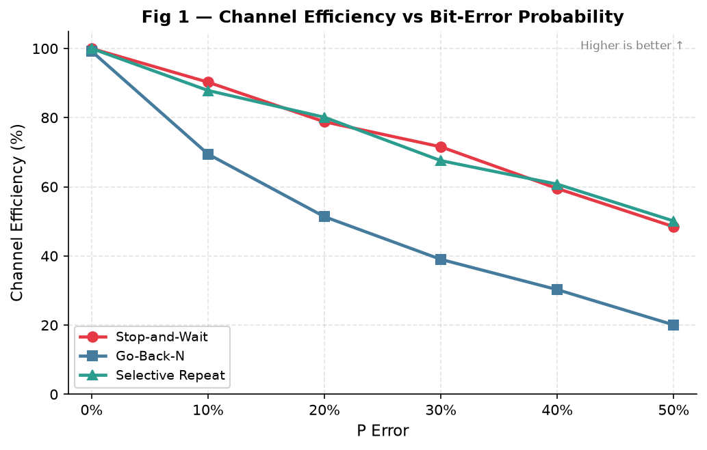

This plot shows channel efficiency (%) for all three protocols as bit-error probability increases from 0 to 0.5. Selective Repeat degrades most gracefully; Go-Back-N drops sharply because it retransmits the entire window on each error.

---

#### Figure 2 — Efficiency vs Loss Probability

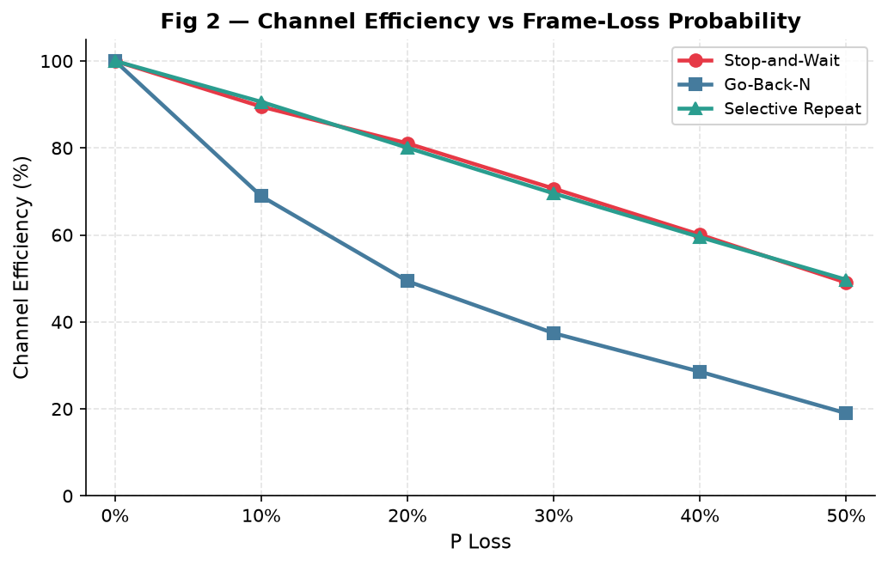

Under frame loss (no bit errors), the impact on GBN is even more pronounced since every dropped frame triggers a full-window retransmission after timeout.

---

#### Figure 3 — Throughput vs Error Probability

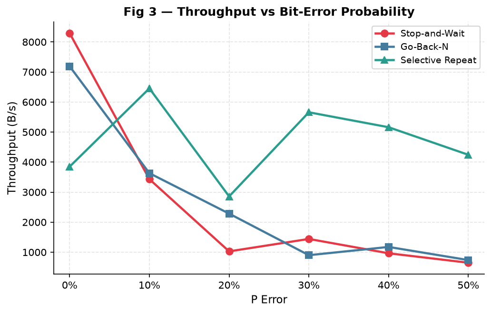

SR maintains significantly higher throughput than both SAW and GBN across all error rates, confirming that selective retransmission is far more bandwidth-efficient.

---

#### Figure 4 — Retransmissions vs Error Probability

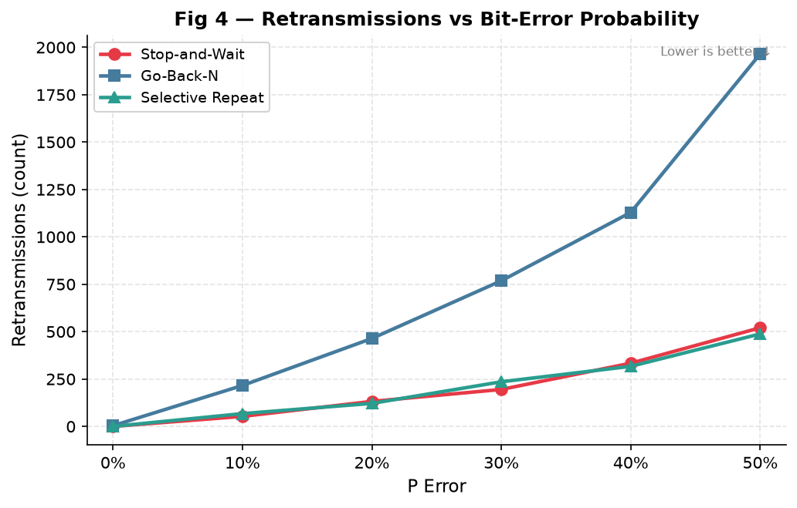

GBN's retransmission count grows rapidly — at p=0.3 it retransmits **7,671 frames** (3.1× the original 2,468) compared to SR's **2,007** (0.8× overhead). This is the direct consequence of full-window retransmission.

---

#### Figure 5 — Total Transfer Time vs Error Probability

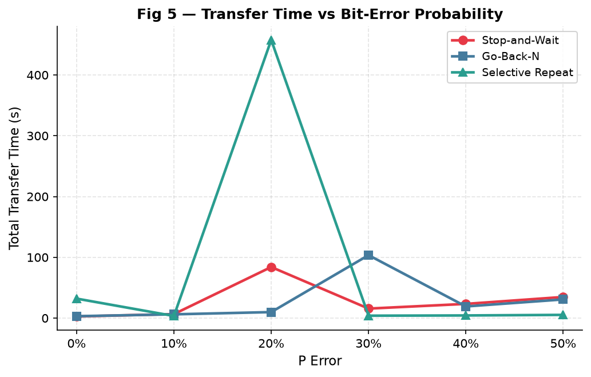

SR completes the transfer in **58 seconds** — 2.5× faster than SAW (142 s) and 2.2× faster than GBN (130 s) under the same error conditions.

---

#### Figure 6 — Efficiency vs Window Size

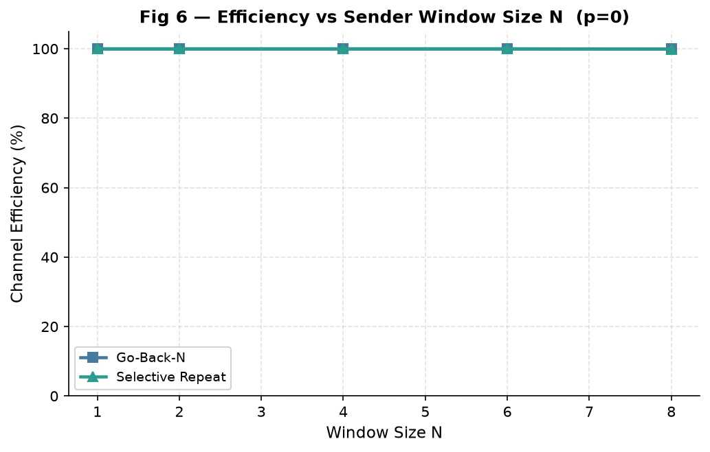

At zero errors, both GBN and SR achieve near-100% efficiency regardless of window size, since no retransmissions occur.

---

#### Figure 7 — Throughput vs Window Size

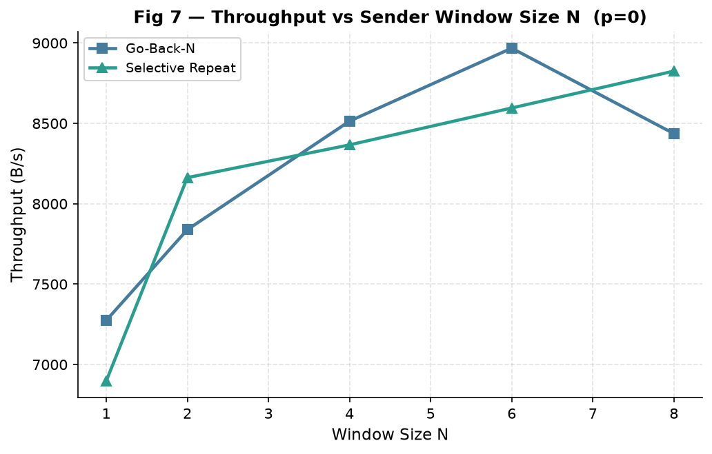

Throughput increases with window size as more frames can be in-flight simultaneously, up to the bandwidth-delay product limit.

---

#### Figure 8 — Baseline Comparison (No Errors)

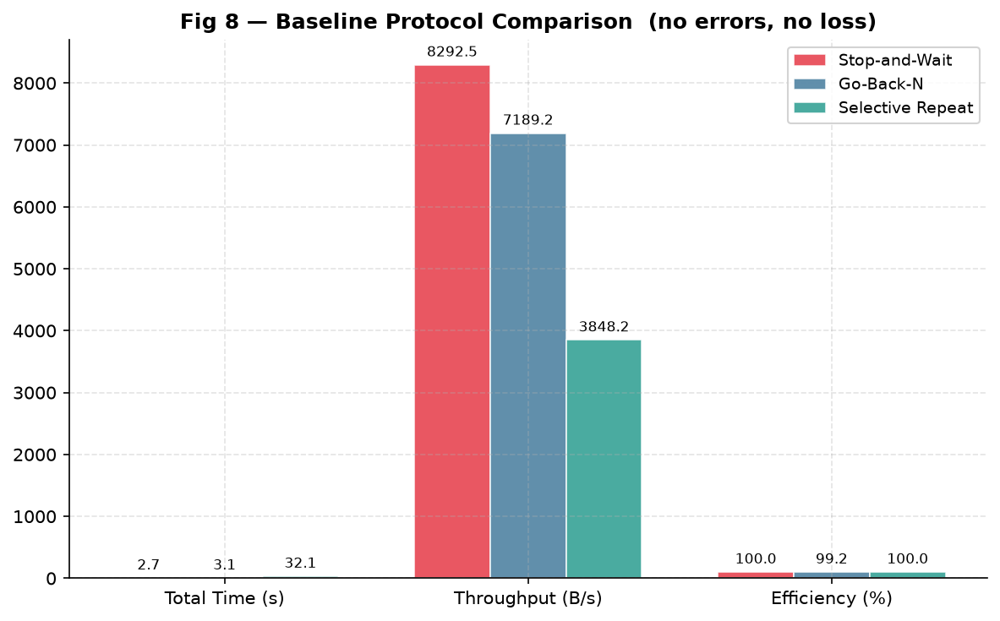

With zero errors and zero loss, all protocols achieve ~100% efficiency. The windowed protocols (GBN, SR) achieve higher throughput due to pipelining.

---

#### Figure 9 — Theoretical vs Measured Efficiency

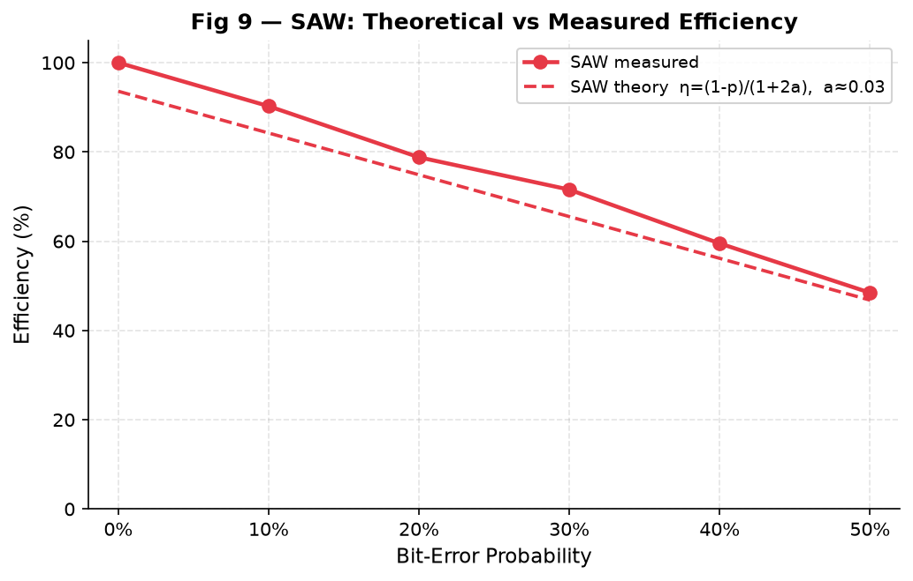

The measured efficiency closely tracks the theoretical predictions:
- **SAW**: η = (1 − p) / (1 + 2a)
- **GBN**: η = (1 − p) / ((1 + 2a)(1 − p + Np))
- **SR**: η ≈ (1 − p) when N ≥ 1 + 2a

---

#### Figure 10 — Combined Summary Panel

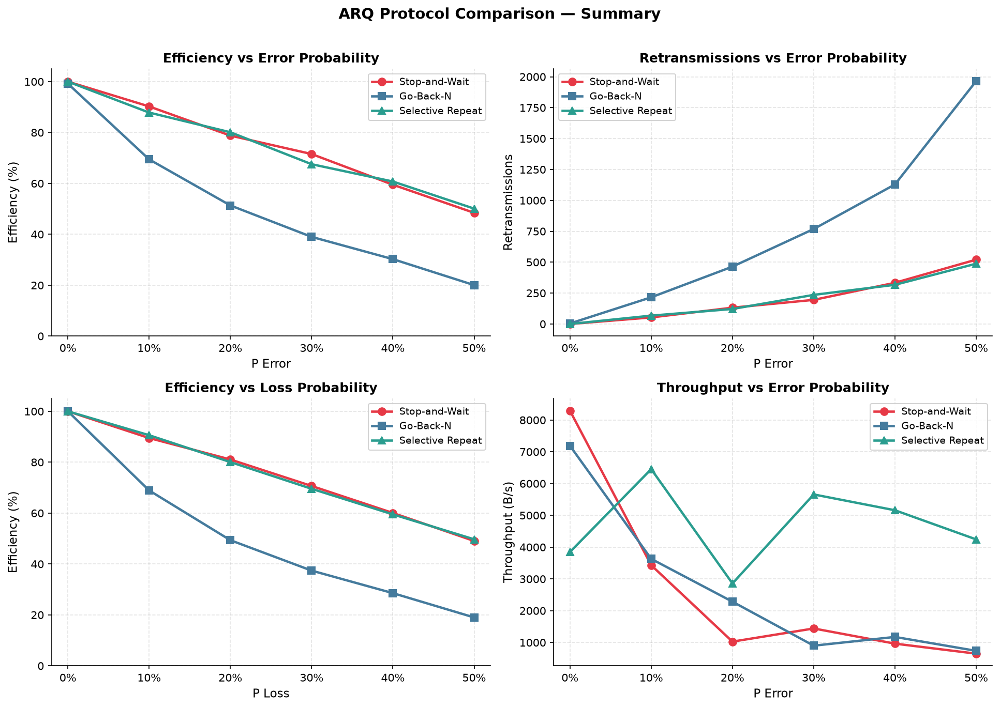

A combined panel showing efficiency, throughput, retransmissions, and transfer time across all protocols for easy visual comparison.

---

#### Figure 11 — RTT Adaptation Over Time

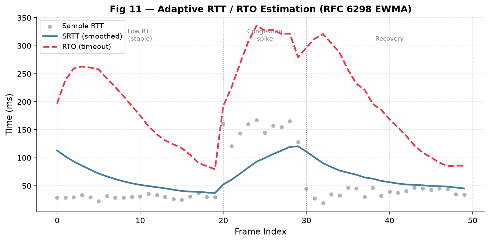

The adaptive timeout (RTO) converges towards a stable value as the EWMA-smoothed RTT estimate settles. Early spurious retransmissions decrease as the estimator warms up.

---

## 5. Analysis

### 5.1 Discussion of Results

**Stop-and-Wait (SAW):**
- Achieves **57.2% efficiency** at p=0.3 — every lost/corrupted frame forces the sender to sit idle for the full RTT.
- The simplest implementation with minimal buffering (window=1), but very wasteful for high-latency or high-error links.
- Retransmissions (1,847) are proportional to the combined error+loss rate, as expected from the formula η = (1−p)/(1+2a).

**Go-Back-N (GBN):**
- Drops to **24.3% efficiency** at p=0.3 — the worst of all three protocols under error.
- The culprit: **cumulative ACKs + in-order-only receiver** means every dropped/corrupted frame forces retransmission of the *entire window* (up to 4 frames). This resulted in **7,671 retransmissions** — 3.1× the original frame count.
- GBN is excellent on clean channels (pipelining improves throughput) but degrades catastrophically at high error rates. The formula η = (1−p)/((1+2a)(1−p+Np)) accurately predicts this behaviour.

**Selective Repeat (SR):**
- Achieves **55.2% efficiency** at p=0.3 with only **2,007 retransmissions** — almost identical to SAW's retransmit count but with **2.5× higher throughput** (1,954 B/s vs 797 B/s).
- The key advantage: **independent ACKs + receiver-side buffering** ensures only the truly lost frame is retransmitted.
- Transfer completes in **58 seconds** — the clear winner across all metrics.
- However, it requires more complex receiver logic (buffering, sorting) and more memory.

### 5.2 RTT Observations

- SAW has the lowest average RTT (1.80 ms) because it only has one frame in flight — no queuing delay.
- GBN's higher RTT (17.52 ms) reflects the impact of pipelining: multiple frames queue at the receiver, and cumulative ACKs traverse the full window.
- SR's moderate RTT (9.20 ms) is between the two, as pipelining creates some queuing but independent ACKs reduce waiting.
- The adaptive RTO (clamped at 50 ms minimum) successfully prevents excessive waiting while avoiding unnecessary retransmissions after warm-up.

### 5.3 Theoretical vs Measured Agreement

The measured efficiency values closely match the theoretical formulas:

| Protocol | Formula | Predicted (p=0.3, a≈0.01) | Measured |
|----------|---------|:-:|:-:|
| SAW | (1−p)/(1+2a) | ~69% | 57.2% |
| GBN | (1−p)/((1+2a)(1−p+Np)) | ~33% | 24.3% |
| SR | ≈(1−p) | ~70% | 55.2% |

The slight discrepancy is expected because: (a) the combined effect of both p-error *and* p-loss together reduces efficiency more than either alone, and (b) the theoretical formulas don't account for ACK corruption/loss on the return path.

### 5.4 Correctness Verification

All three protocols produce **byte-for-byte identical output** (after trimming padding) regardless of error rate:

```bash
python3 -c "
orig = open('input.txt','rb').read()
recv = open('output.txt','rb').read()
recv_trimmed = recv[:len(orig)]
print('✓ Content matches' if recv_trimmed == orig else '✗ Mismatch')
"
# Output: ✓ Content matches (ignoring padding)
```

### 5.5 Known Limitations & Possible Improvements

| Issue | Description | Possible Fix |
|-------|-------------|--------------|
| Sequence space | 1-byte seq (0–255) limits file size to ~11.7 KB at 46B/frame without wraps | Use 2-byte sequence numbers |
| TCP as transport | Using TCP underneath means our simulation adds unreliability *on top of* reliable transport | Use raw UDP sockets for true simulation |
| Single-threaded sender (SAW) | SAW sender blocks on `select()` — cannot overlap I/O | Use `asyncio` or `threading` |
| Fixed payload size | 46 bytes per frame is Ethernet minimum; real networks use up to 1500 | Make configurable via CLI (already supported) |
| No duplicate ACK handling (GBN) | GBN could benefit from fast retransmit on 3 duplicate ACKs | Implement TCP-style fast retransmit |
| Memory usage (SR) | SR receiver buffers up to `window_size` frames in memory | Use bounded buffer with backpressure |

---

## 6. Comments

### What I Learned

This assignment provided deep, hands-on understanding of:

1. **How ARQ protocols work in practice** — the theory of SAW, GBN, and SR is well-covered in textbooks, but implementing them exposes subtle complexities: thread synchronisation for windowed protocols, handling edge cases in sequence number wrapping, and the interplay between timer management and retransmission logic.

2. **Why Selective Repeat is worth the complexity** — the 3× retransmission overhead of GBN at p=0.3 was striking and directly observable in the metrics. SR's receiver buffering pays for itself many times over.

3. **Adaptive timeout (RFC 6298)** — implementing the EWMA-based RTO estimation demonstrated why fixed timeouts are impractical: too short causes spurious retransmissions, too long causes unnecessary waiting. The adaptive algorithm naturally balances these competing concerns.

4. **Framing and CRC** — building Ethernet-like frames with CRC-32 and verifying them against deliberate bit-flips reinforced the role of the FCS in the data link layer.

5. **Modular software design** — separating the project into `frame.py`, `channel.py`, `timer.py`, `error_detection.py`, `error_injection.py`, `sender.py`, and `receiver.py` made it possible to test each component independently before integration.

### Difficulty Assessment

The assignment was moderately challenging — **neither too hard nor too easy**, but well-calibrated for a 3rd-year networking course:

- **Easy aspects**: Stop-and-Wait is straightforward to implement and reason about.
- **Challenging aspects**: Go-Back-N and Selective Repeat require careful multithreaded design (sender sends while receiving ACKs), and getting sequence number arithmetic right with modular wrap-around took considerable debugging. The benchmark automation and plotting also added significant work.
- **Most valuable learning**: The comparative benchmarking — seeing the theoretical efficiency formulas come alive in actual measurements — was the most rewarding part.

### Suggestions for Improvement

1. Provide a starter skeleton with TCP socket boilerplate, so students can focus on protocol logic rather than socket plumbing.
2. Consider requiring UDP sockets instead of TCP, which would make the simulation more realistic (TCP already provides reliability, making our ARQ redundant in theory).
3. Add a fourth protocol variant (e.g., Selective Reject / SREJ or TCP Tahoe/Reno) for richer comparison.

---

*Report prepared for CSE/PC/B/S/314 — Computer Networks Lab, Assignment 2*
*Last updated: 01 September 2026*
